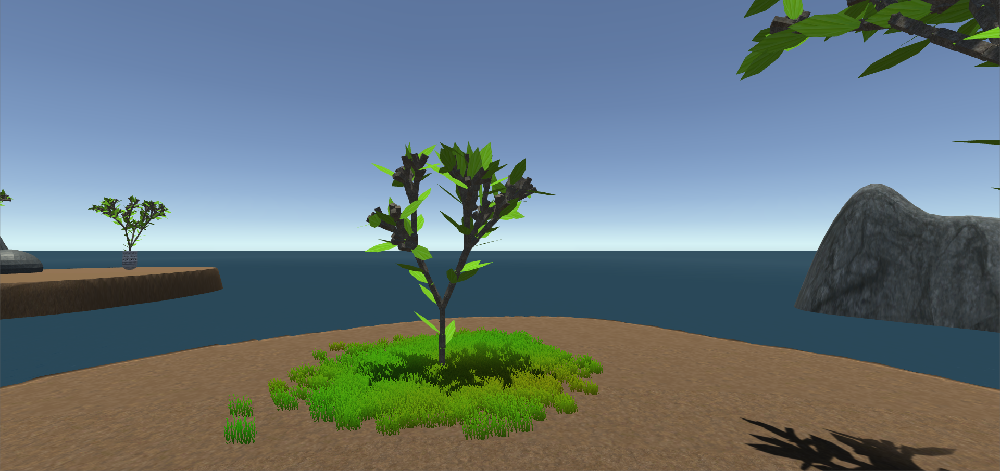
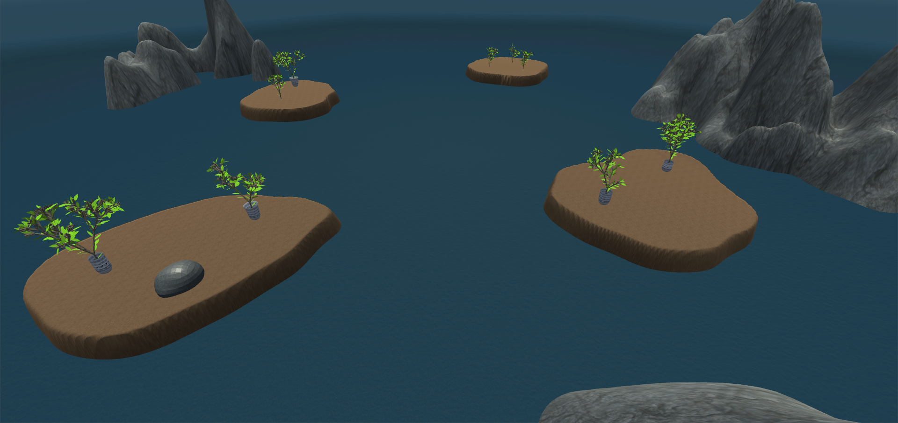

S3D: Assignment #2
===

The code for this assignment can be found [here](...).

For this assignment, a simple scene was prepared in Unity. It is composed of:

 - A terrain (from Unity);
 - Water (from Unity's Standard Assets);
 - [Procedural rocks](#rocks) (from [Assignment 1](https://dccsillag.github.io/coursework/3dGraphicsSystems/Assignment1/index.html#rocks));
 - [Procedural vases](#vases) (from [Assignment 1](https://dccsillag.github.io/coursework/3dGraphicsSystems/Assignment1/index.html#bowls-vases));
 - And [procedural trees](#growing-trees), that grow over time (based on [the Bushes from Assignment 1](https://dccsillag.github.io/coursework/3dGraphicsSystems/Assignment1/index.html#bushes)).

## Rocks

The same algorithm was used, with the only addition of the UV mapping, which was simply done by mapping a
triangle with vertices $v_0$, $v_1$, $v_2$ to $(0, 0)$, $(1, 0)$, $(1, 1)$.

## Vases

The same algorithm was used, and the UV mapping was simply $(\theta, t)$ for every generated vertex.

## Growing Trees

The tree is based on [the Bushes from Assignment 1](https://dccsillag.github.io/coursework/3dGraphicsSystems/Assignment1/index.html#bushes),
which are generated using a Stochastic L-System on an alphabet with turtle graphics interpretation. The one used there was

$$\begin{array}{cclcl}
\omega & : & \mathtt{A} \\
p_0'   & : & \mathtt{A} & \xrightarrow{0.34} & \mathtt{[\&FLA]/////[\&FLA]///////[FBA]} \\
p_0''  & : & \mathtt{A} & \xrightarrow{0.33} & \mathtt{[\&LA]/////[\&FLA]///////[FBA]} \\
p_0''' & : & \mathtt{A} & \xrightarrow{0.33} & \mathtt{[\&FLA]/////[\&LA]} \\
p_1    & : & \mathtt{F} & \xrightarrow{}     & \mathtt{S/////F} \\
p_2    & : & \mathtt{S} & \xrightarrow{}     & \mathtt{FL} \\
p_3    & : & \mathtt{L} & \xrightarrow{}     & \mathtt{[ \wedge \wedge \{-f+f+f-|-f+f+f \}]} \\
p_4    & : & \mathtt{B} & \xrightarrow{}     & \mathtt{[-Fb]}
\end{array}$$

With the alphabet

| Symbol |                                                       Action |
|:-------|-------------------------------------------------------------:|
| `F`    |                               Walk forward, drawing the path |
| `f`    |                        Walk forward, but don't draw the path |
| `+`    |                                                     Yaw left |
| `-`    |                                                    Yaw right |
| `&`    |                                                   Pitch down |
| `^`    |                                                     Pitch up |
| `\`    |                                                    Roll left |
| `/`    |                                                   Roll right |
| `|`    |                                                  Turn around |
| `[`    |                                        Push turtle to stack  |
| `]`    |                                        Pop turtle from stack |
| `{`    |                                      Start drawing a polygon |
| `}`    |                                     Finish drawing a polygon |
| `A`    |                                                 Dummy symbol |
| `B`    |                                                 Dummy symbol |
| `S`    |                                                 Dummy symbol |
| `L`    |                                                 Dummy symbol |
| `b`    | A flower heading the turtle's direction, from `magnolia.obj` |

Since the flower (the `b` instruction above) is simply a static mesh, we can't animate it growing.
Also, since we want more of a tree than a bush, we add some forward instructions before the `A` symbol
in the axiom. The resulting L-System is

$$\begin{array}{cclcl}
\omega & : & \mathtt{0$SA} \\
p_0'   & : & \mathtt{A} & \xrightarrow{0.34} & \mathtt{[\&F\%LA]/////[\&F\%LA]///////[F\%A]} \\
p_0''  & : & \mathtt{A} & \xrightarrow{0.33} & \mathtt{[\&LA]/////[\&F\%LA]///////[F\%A]} \\
p_0''' & : & \mathtt{A} & \xrightarrow{0.33} & \mathtt{[\&F\%LA]/////[\&LA]} \\
p_1    & : & \mathtt{F} & \xrightarrow{}     & \mathtt{S/////F} \\
p_2    & : & \mathtt{S} & \xrightarrow{}     & \mathtt{FL} \\
p_3    & : & \mathtt{L} & \xrightarrow{}     & \mathtt{[1 \wedge \wedge \{-f+f+f-|-f+f+f \}]} \\
\end{array}$$

With the alphabet

| Symbol |                                                                                  Action |
|:-------|--------------------------------------------------------------------------------------:|
| `F`    |                                                          Walk forward, drawing the path |
| `f`    |                                                   Walk forward, but don't draw the path |
| `+`    |                                                                                Yaw left |
| `-`    |                                                                               Yaw right |
| `&`    |                                                                              Pitch down |
| `^`    |                                                                                Pitch up |
| `\`    |                                                                               Roll left |
| `/`    |                                                                              Roll right |
| `|`    |                                                                             Turn around |
| `[`    |                                                                   Push turtle to stack  |
| `]`    |                                                                   Pop turtle from stack |
| `{`    |                                                                 Start drawing a polygon |
| `}`    |                                                                Finish drawing a polygon |
| `$`    | Add a face whose normal goes in the opposite direction of the turtle's direction vector |
| `%`    |     Add a face whose normal goes in the same direction as the turtle's direction vector |
| `0`    |                                                        Set the texture to the tree bark |
| `1`    |                                                             Set the texture to the leaf |
| `A`    |                                                                            Dummy symbol |
| `S`    |                                                                            Dummy symbol |
| `L`    |                                                                            Dummy symbol |

---

We start by generating a list of instructions for our turtle, as if we were making a static mesh.
The growing animation is accomplished by recreating a mesh from the instructions for each frame,
but stopping each time after a certain amount of increasing steps.

The parameters necessary are:

 - Number of steps per "Forward" instruction;
 - Number of steps to start at (usually 0)
 - Maximum number of steps we want to progress at the time;

Then, to generate a mesh for some frame where we have already progressed $i$ frames,
we do as normal (starting from our origin), with the following exceptions:

 - Forward: the amount to step, instead of simply being $\delta$ (step size), becomes
$(\delta / n) \min \{m - i, n\},$ with $m$ being the maximum number of steps to progress, $i$ the
number of steps already progressed and $n$ the number of steps per "Forward" instruction.
Finally, we step $\min \{m - i, n\}$.
 - Rotations: the shoulder (to not leave a gap into the mesh) should not be inserted if $i \geq m$
(where $i$ is the number of steps progressed so far and $m$ is the maximum number of steps to progress).
 - Starting Polygons: (This is used to generate the leaves in the trees) When we start the polygon, we calculate
a step size for it: $\delta_0 = (\delta / n) \min \{m - i, n\}$. Whenever we use an instruction that will add an
edge to the polygon, we use $\delta_0$ as our step size.

Finally, to apply textures, we need an UV mapping to be applied to our mesh's faces. This way, the rendering engine
knows which coordinate of the texture image to apply to that position in the mesh's surface.

If the tree was static, the mapping would be quite simple; for each face, its vertices $v_0$, $v_1$, $v_2$ and $v_3$ have
UVs $(0, 0)$, $(1, 0)$, $(1, 1)$ and $(0, 1)$, respectively. However, it is growing; if we were to use the same
mapping, the textures would move along with the branches, which would look quite strange. Instead, we use the mapping
$(0, 0)$, $((1/n) \min \{m - i, n\}, 0)$, $((1/n) \min \{m - i, n\}, 1)$, $(0, 1)$.

## Screenshots

